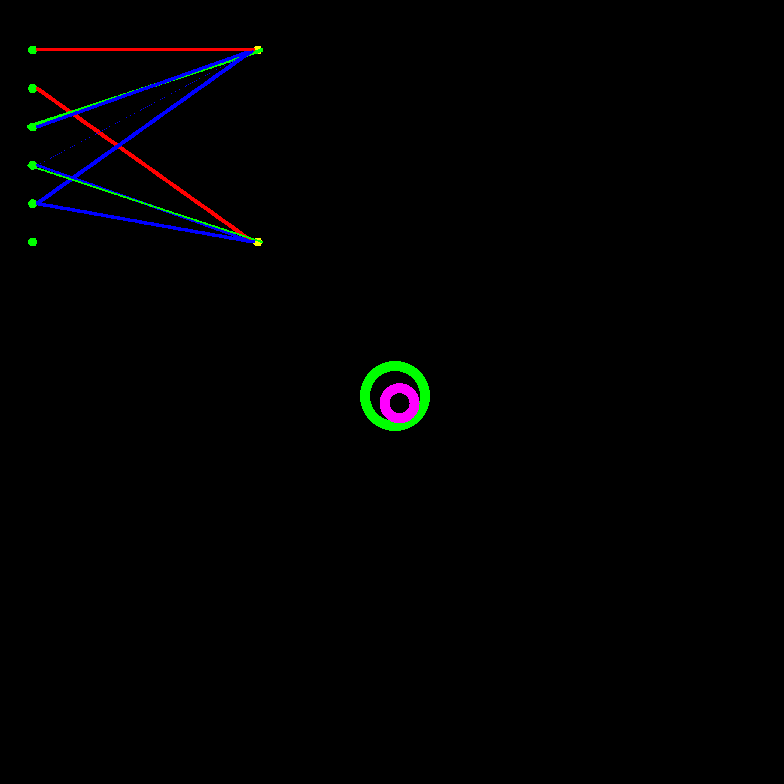

# Teaching an agent to push a ball to a target with the NEAT algorithm
## Results
Below are some results of training. In both scenarios, there are situations where the agents fails to push the ball to the center on the first try, then gets confused and pushes the ball off-screen. I think this is probably due to my fitness function not penalising failiurs enough. In the future I may add a term which gives a penalty if the ball is found outside a certain range.   
In the below experiments, red and blue synapses are forward facing synapses, and yellow and green synapses are recurrent (backward facing) synapses.

### Simple Network
This network was trained with a relatively high penalty for having too many synapses. For this reason, it seems to have found the optimal solution has no hidden nodes. However, the network still performs relatively well.

### More Complex Network
This network was trained with a lower penalty for having too many synapses. It has developed a hidden node (which has a ReLU activation), and also more synapses than the simple network. It seems to perform slightly better.

### Very Complex Network
This network had no penalty for having extra synapses, allowing it to grow more complex than the previous two tests. It seems to get confused a lot less than the previous two, and I noticed that in the situations where it did miss the target, it usually was able to try again as opposed to pushing the ball off-screen.   
Interestingly, despite the fact that there is no direct synapse penalty, the network is still not dense (every node connects to every other node). I think this might be a combination of the fact that a dense network will have lots of output noise (causing the agent to be shaky and not perform well), and the fact that the mutation function has the possibility of pruning synapses, allowing unnecessary synapses and neurons to be removed.

## How the agent is trained
The agent uses a NEAT network as its brain. The network can include recurrent (backwards) synapses, which allow it to have a primitive type of memory.

Each generation, I simulate each agent on 10 differnt scenarios, where each scenario the agent and target start at a random position. The agent will always start the same distance from the target and the target will be the same distance from the centre. These scenarios last 10 seconds of simulated time, and after the ten seconds, a fitness for that scenario is calculated, which incentivises three different steps (in order): touch the ball, push the ball to the target, run away from the target. You can see more about how this fitness function works in `sim.go:48`.

The inputs to the network are the normalised x and y distance to the ball from the agent, the normalised x and y distance to the centre from the agent, an indicator whether the ball has reached the target or not, and a bias value that is always 1. I use linear activations on input nodes, tanh on output nodes, and ReLU on hidden nodes.

## Run the code yourself
I have only ever tested this on linux, but it should run on other OSs. To run a new training run `go run . -n <name>`, which generates the networks to `nets/<name>`. To run a previously trained network run `go run . -n <name> -s`, which will load the named network and run a window. To reset the state whilst in the window press _r_.
