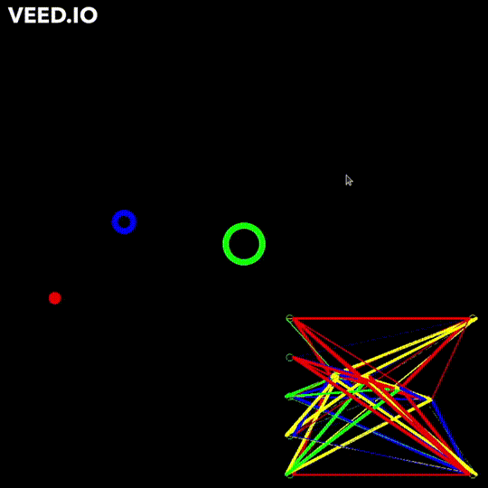

# Example usage of NEAT algorithm (except speciation) to make a robot push a ball into a target
In the below video, the robot is the red circle and the ball is the blue circle. The robots goal is to push the ball into the green circle (target). In the lower right hand conrner you can see a depiction of the network (this does not show any current inputs, just the structure).

## How the robot is trained
The robot uses a NEAT network as its brain. The network can include recurrent (backwards) connections, which allow it to have a primitive type of memory. These are depicted as green and yellow lines in the picture, whereas normal connections are blue and red.

Each generation, I simulate each robot on 5 differnt scenarios, where each scenario the robot and target start at a random position. The robot will always start the same distance from the target and the target will be the same distance from the centre. These scenarios last 10 seconds of simulated time, and after the ten seconds, a fitness for that scenario is calculated, which consists of the distance from the robot to the ball, and the distance from the ball to the centre. I include the distance from the robot to the ball because it incentivizes exerimentation around the ball. I also weight the distance from ball to centre more heavily than robot to ball, as the final goal is to push the ball to the center.

The inputs to the network are the normalised x and y distance to the ball from the robot, the normalised x and y distance to the centre from the robot, and a bias value that is always 1. I use linear activations on input nodes, tanh on output nodes, and a variation of ReLU for hidden nodes, which has equation `ln(x+1)` when `x>0`. I found this prevents the recurrent connections creating very large value in the network.
